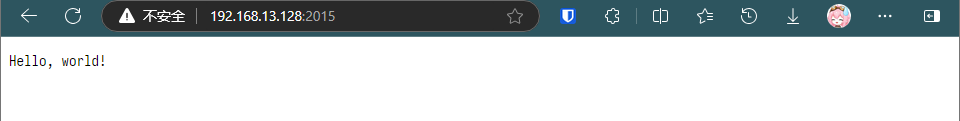
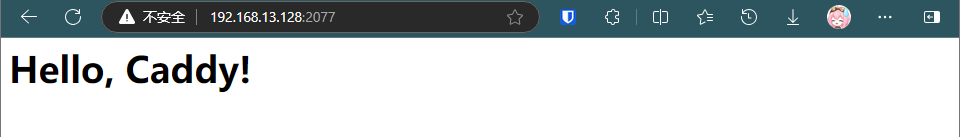
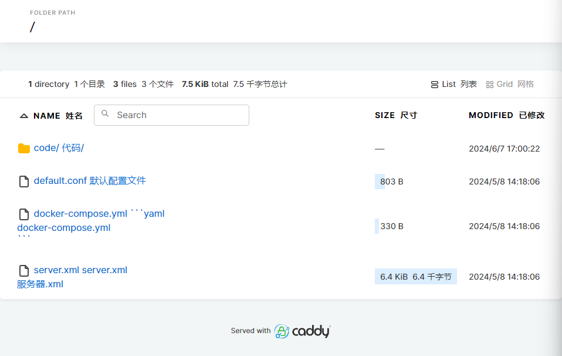
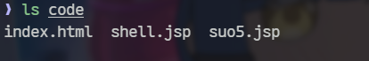
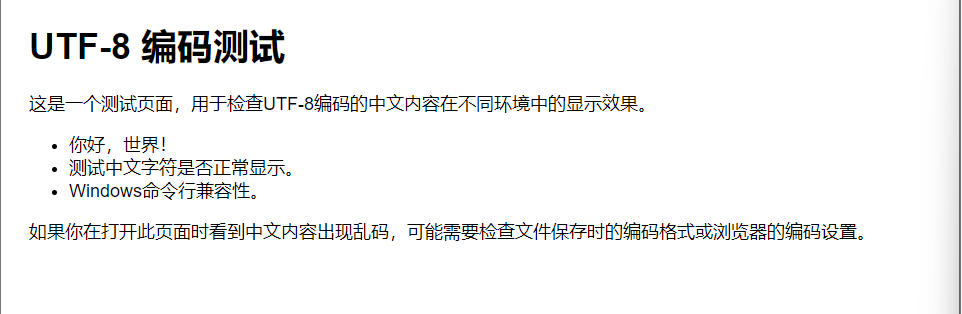

## 什么是 Caddy

Caddy 是一个开源的 Web 服务器，它以简单易用著称。与传统的 Web 服务器如 Apache 和 Nginx 相比，Caddy 设计的目标是提供一种更容易设置和维护的方式，来配置和管理 Web 服务。

## 为什么使用 Caddy 而不是 Nginx

首先需要强调的是，Nginx 的配置文件在我看来实在是有点过于繁琐了，我之前为了 MC 联机，使用 DDNSGO 绑定我本机的 IPV6 地址，然后因为我的域名没有备案，所以为了能不带端口访问，我又使用 Nginx 套了一层反向代理，那个配置文件写的我烦得要死，明明只是一个基础的反向代理都要写好多配置文件。

正好同时又了解到了 Caddy 和 OpenResty 这两个 HTTP 服务器，但是看了一下，OpenResty 的核心配置依旧是 Nginx，基于 Nginx 的服务器加上 Lua 拓展了一些别的功能，配置文件还是 Nginx 那套，难写得很，加上 OpenResty 我可以直接使用 1Panel 面板进行操作，所以命令行的 HTTP 服务器我最后选择了 Caddy

Caddy 相比 Nginx 的优势在于：

1. 简单易用：配置文件使用`Caddyfile`，简单好写，语法明确
2. 自动化程度高：TLS 证书签发和域名解析等工作都可以自动化
3. 部署简单：一个 Docker 容器就可以部署，或者直接`caddy run`也可以启动
4. 功能强大：虽然很多功能我依旧用不上，但是有就不错，比如反代，静态文件服务
5. 社区和文档支持：Caddy 的官方文档已经是比较详细的了，Google 能搜到的解决办法也不少，而且整体社区比较年轻

## 安装

Caddy 的安装比较简单，我这里主要使用两种方式，一种是包管理器直接安装，后续使用命令行启动服务器，另一种是 Docker 容器部署

### 包管理器

我这里使用的是 Rocky Linux9.3，一个基于 CentOS 的衍生发行版，使用 DNF 和 YUM 作为包管理器，安装流程如下

import Tabs from '@theme/Tabs';
import TabItem from '@theme/TabItem';

<Tabs>
<TabItem value="bash1" label="DNF">

```bash
# 安装 dnf-plugins-core 以确保支持 Copr 软件仓库
sudo dnf install -y dnf-plugins-core

# 启用 @caddy/caddy 的 Copr 仓库
sudo dnf copr enable --just-refresh -y @caddy/caddy

# 从启用的 Copr 仓库中安装 Caddy
sudo dnf install -y caddy
```

</TabItem>
<TabItem value="bash2" label="YUM">

```bash
# 安装 yum-plugin-copr 以确保支持 Copr 软件仓库
sudo yum install -y yum-plugin-copr

# 启用 @caddy/caddy 的 Copr 仓库
sudo yum copr enable --just-refresh -y @caddy/caddy

# 从启用的 Copr 仓库中安装 Caddy
sudo yum install -y caddy
```

</TabItem>
</Tabs>

### Docker 安装

直接执行

```bash
docker pull caddy
```

## 使用

### 基于命令行的使用

#### API

如果我们是通用包管理器安装的 Caddy，那么此时我们可以直接在命令行执行`caddy start`

```bash
❯ caddy start
2024/10/17 15:18:49.825 INFO    admin   admin endpoint started  {"address": "localhost:2019", "enforce_origin": false, "origins": ["//localhost:2019", "//[::1]:2019", "//127.0.0.1:2019"]}
2024/10/17 15:18:49.825 INFO    serving initial configuration
Successfully started Caddy (pid=337262) - Caddy is running in the background
```

看到如下输出之后，说明 Caddy 已经运行在 2019 端口上，但此时配置文件是空白的，我们需要给他加载一个配置文件，我们这里使用官方的示例

```bash
curl localhost:2019/load \
    -H "Content-Type: application/json" \
    -d @- << EOF
{
  "apps": {
    "http": {
      "servers": {
        "hello": {
          "listen": [
            ":2015"
          ],
          "routes": [
            {
              "handle": [
                {
                  "handler": "static_response",
                  "body": "Hello, world!"
                }
              ]
            }
          ]
        }
      }
    }
  }
}
EOF
```

然后我们使用浏览器访问 虚拟机地址:2015，



可以看到 HTTP 服务已经正常启动

#### Caddyfile

首先创建一个名位`Caddyfile`的文件，无拓展名

然后写入如下内容

```caddyfile
# 定义一个虚拟主机，监听在 2077 端口
:2077 {
    # 指定根目录为 /var/www/testsite/html
    root * /var/www/testsite/html
    
    # 启用文件服务器功能，允许访问该目录下的静态文件
    file_server
}
```

然后创建网站根目录相关的内容

```bash
mkdir -p /var/www/testsite/html
echo '<html><body><h1>Hello, Caddy!</h1></body></html>' > /var/www/example.com/html/index.html
```

然后在拥有`Caddyfile`的目录下执行`caddy start`，此时我们访问虚拟机 IP:2077，可以看到



可以看到 HTTP 服务器已经成功启动

#### 静态文件

Caddy 同样可以像 Python 的 http.server 模块一样，搭建一个临时的静态文件服务器

因为这个用处不是很大，使用场景也比较特殊，所以我这里只记录命令行的使用方法，其余的可以去[官方文档](https://caddyserver.com/docs/quick-starts/static-files)了解

在终端中，切换到网站的根目录，然后执行

```bash
caddy file-server --listen :2033
```

然后再浏览器中打开地址：端口号查看网站

:::warning

如果没有索引文件，例如`index.html`之类的文件的话，记得加上`--browse`切换成浏览文件模式，不然会无法访问

:::

文件浏览模式如下



比 Python 自带的是要美观一点的，但这又不是纯粹的文件浏览模式，因为当你点击目录，而目录中有索引文件时，他还是会第一时间渲染出来，例如我们点击 code 文件夹，这里面放了一个`index.html`文件，就会被立刻渲染


而其中的别的文件则无法显示



### 基于 Docker 构建

使用 Docker 也可以创建一个 HTTP 服务器，我们按照上述的内容，先将 Caddy 的镜像拉取下来，我这里使用 Docker Compose 完成容器的搭建，因为我不太喜欢用 Docker Run

首先创建一个`docker-compose.yml`，然后写入官方推荐的示例

```yaml
services:
  caddy:
    image: caddy:latest
    restart: unless-stopped
    ports:
      - "80:80"
      - "443:443"
      - "443:443/udp"
    volumes:
      - ./Caddyfile:/etc/caddy/Caddyfile
      - ./site:/srv
      - caddy_data:/data
      - caddy_config:/config

volumes:
  caddy_data:
  caddy_config:
```

然后将网站的静态文件放到`/site`文件夹中，容器启动之后他会被复制到容器中的`/srv`文件夹中作为网站的根目录，然后再创建一个`Caddyfile`，放到`compose`文件同级目录下，然后执行

```bash
docker compose up -d
```

即可启动一个 caddy 的容器，然后访问地址即可


