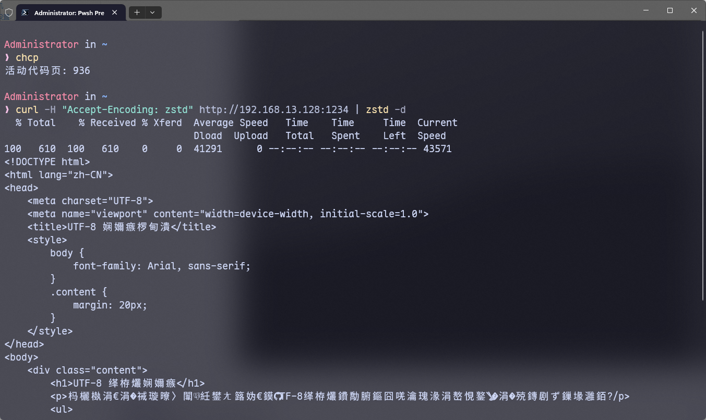
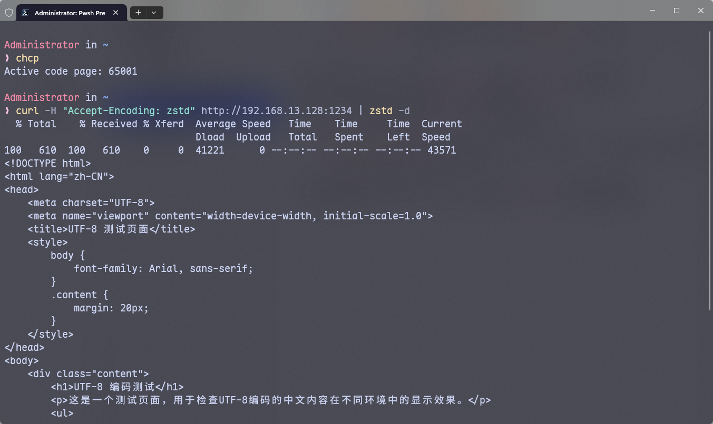

## 前言

Windows 的默认编码一直都是 GBK，这就导致很多 UTF-8 编码的内容如果直接输出大概率会是乱码的，例如 Windows 的通知和命令行输出，都是乱码的集中地点，例如当我们使用默认的编码去访问一个 UTF-8 的页面时，返回的内容就会变成这样



## 解决办法

解决办法很简单，就是让`pwsh`的输出和输入内容都变成 UTF-8，虽然也可以修改系统全局编码为 UTF-8，但是那个方式太暴力，很多的 Windows 软件对于 UTF-8 的支持是很差的

首先打开`pwsh`的`profile`文件，如果没有就执行

```powershell
if (!(Test-Path -Path $PROFILE)) {  
    New-Item -ItemType File -Path $PROFILE -Force  
}
```

执行上述命令后，可以使用`$profile`来查看`profile`文件的位置

然后写入下面的内容来设置`pwsh`的默认编码为 UTF-8

```powershell
$OutputEncoding = [console]::InputEncoding = [console]::OutputEncoding = [Text.UTF8Encoding]::UTF8
```

然后我们重启 Windows Terminal，再次执行`curl`命令查看返回内容



可以看到已经没有任何乱码了